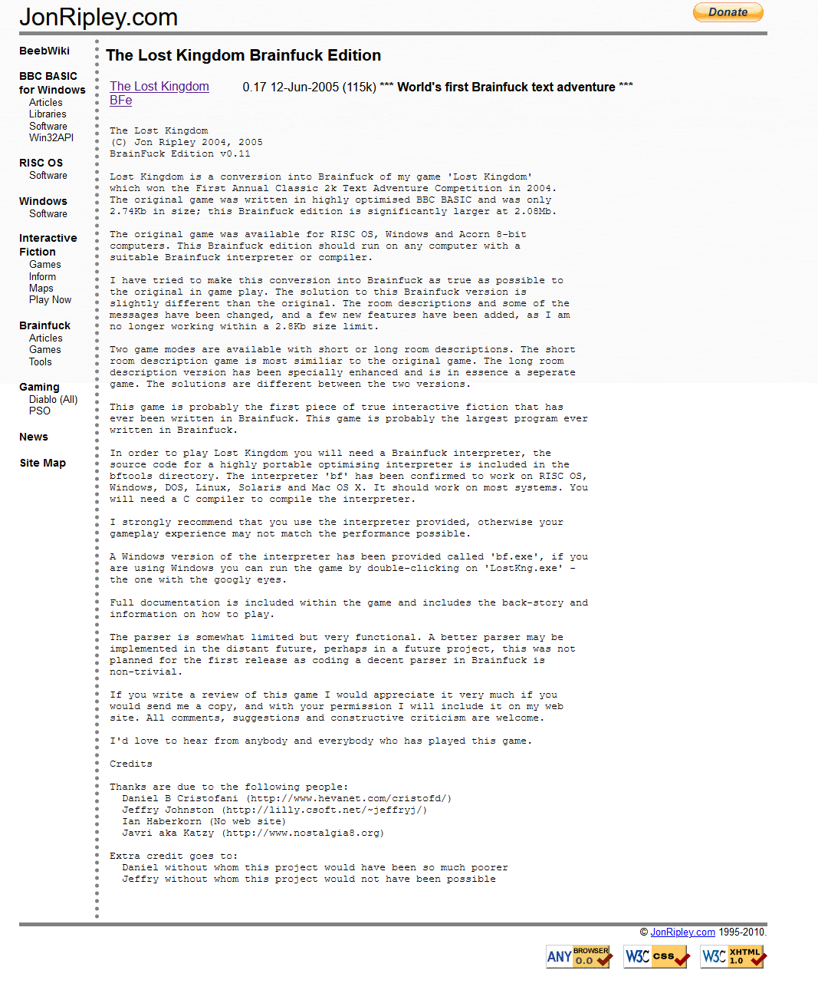

</img>

## StegFuck
This program takes a Brainfuck program and uses Steganography witchcraft to encode it as an image. 

# Requirements
  Python 3
  Pillow (install using `python3 -m pip install pillow`)
  (I suggest anaconda :P)
  
# Usage 
  encoding a file:  
  `python3 sf4jrlkbfe.py -e [input image] [-f] [brainfuck code inline or code file] [output image]`
  
  running a Lost Kingdom game on windows:
  `python sf4jrlkbfe.py lk.png save.txt`
 
 
# Theory of operation. 
  The search term is Steganography. There is a good computerphile video about it. The code is encoded starting at the top left while the length of the program (which is neccessary to halt) is at the bottom right. 
  
 # Why this fork?
bf Steganography lang was not fully compatible with Jon Ripley's Lost Kindom BFe functionality (namely saveing your game) so we added it.
To avoid cheaters or spoilers, I suggest simply recording your desired list of inputs line-for-line in a text file.
But provided is a starter save.txt which will run the program and execute all backstory states plus enable long descriptions.

Enjoy!:P
  
